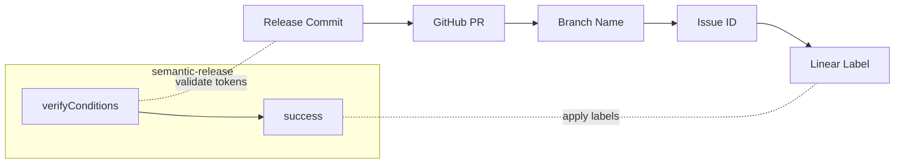

# semantic-release-linear-app

A [semantic-release](https://github.com/semantic-release/semantic-release) plugin that adds version labels to Linear issues based on branch names.

## Install

```bash
npm install --save-dev semantic-release-linear-app
```

## Setup

1. Add to your `.releaserc.json`:

```json
{
  "plugins": [
    "@semantic-release/commit-analyzer",
    "@semantic-release/release-notes-generator",
    ["semantic-release-linear-app", {
      "teamKeys": ["ENG", "FEAT"]
    }],
    "@semantic-release/github"
  ]
}
```

2. Set environment variables:
   - `LINEAR_TOKEN` - Linear API key or OAuth token
   - `GITHUB_TOKEN` - For finding PRs (usually already set in CI)

3. Use branch names with Linear issue IDs:

```
feature/ENG-123-add-auth
bugfix/FEAT-456-fix-bug
ENG-789
```

## Options

| Option | Default | Description |
|--------|---------|-------------|
| `teamKeys` | `[]` | Team keys to filter (e.g., `["ENG"]`) |
| `labelPrefix` | `"v"` | Prefix for version labels |
| `removeOldLabels` | `true` | Remove previous version labels |
| `addComment` | `false` | Add release comment to issues |
| `dryRun` | `false` | Preview without making changes |

## How it Works



1. **verifyConditions** - Validates `LINEAR_TOKEN` and tests API connection
2. **success** - After release:
   - Queries GitHub for PRs associated with release commits
   - Extracts issue IDs from branch names (e.g., `ENG-123`)
   - Creates and applies version label to each issue

## Labels

Labels are color-coded by release type:

| Type | Color | Example |
|------|-------|---------|
| Major | Red | `v2.0.0` |
| Minor | Orange | `v1.1.0` |
| Patch | Green | `v1.0.1` |
| Prerelease | Purple | `v1.0.0-beta.1` |

## Authentication

Set `LINEAR_TOKEN` with a Linear API key or OAuth access token.

For OAuth setup, see [Linear OAuth documentation](https://linear.app/developers/oauth-2-0-authentication).

## License

MIT
